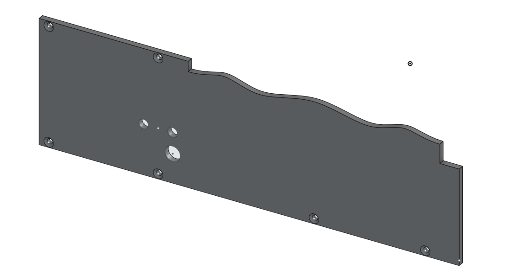

# Models

Here are the 3D models needed for the horse racing track.

They are:

| Part          | Amount | Image |
| --------------- | -------- | ------- |
| Bar           | 3x     |            |
| Figurine      | 3x     |  |
| Grip_Lower    | 3x     |  |
| EndPiece 1    | 2x     |  |
| EndPiece 2    | 2x     |  |
| Track Frame 1 | 1x     |  |
| Track Frame 2 | 1x     |  |
| Track Plate 1 | 1x     |  |
| Track Plate 2 | 1x     |  |
| Track_Section | 4x     |  |

Furthermore, you need

| Part                 | Amount |
| ---------------------- | -------- |
| Stepper motor        | 3x     |
| Stepper motor driver | 3x     |
| Arduino Nano         | 1x     |
| M5x40 flathead screw | ~12    |
| M5 nut               | ~4     |
| M3x10 flathead screw | ~24    |
| M3 nut               | ~12    |
| 2mm nail             | ~4     |
| Lots of wires         | Lots |
