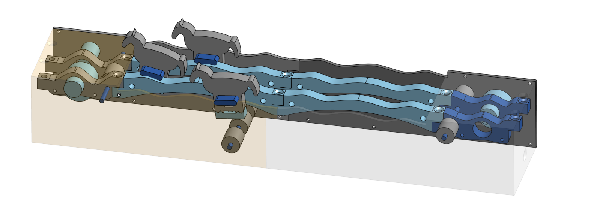

# Pferderennen - Horse Racing

This small project takes an arduino and as many stepper motors as you like. The ones I used here are **28BYJ-48** with an **ULN2003** as the motor driver. Other motors should be supported by implementing the [HorseDriver.h](Firmware/src/modules/HorseDriver.h) interface.

All source code is found under [Firmware](Firmware), while all 3D models as well as a technical sketch and a screenshot of the finished model reside in [Models](Models).

Start and Finish trigger are built as screws which are connected to ground. The Arduino nano connections are:

| Arduino | Other        |
| --------- | -------------- |
| Vin     | VCC          |
| D2      | Start button |
| D3      | M1 IN4       |
| D4      | Reset button |
| D5      | Trigger H1   |
| D6      |              |
| D7      | Trigger H2   |
| D8      | Trigger H3   |
| D9      | H1 IN3       |
| D10     | H1 IN1       |
| D11     | H1 IN2       |
| D12     | H1 IN4       |
| D13     | H2 IN3       |
| A0      | H2 IN1       |
| A1      | H2 IN2       |
| A2      | H2 IN4       |
| A3      | H3 IN3       |
| A4      | H3 IN1       |
| A5      | H3 IN2       |

The connections can be modified in [globals.h](Firmware/src/config/globals.h). All stepper drivers are connected to VCC.
